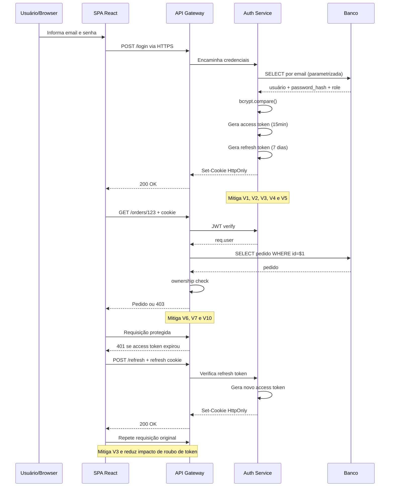

# Q8 — Diagrama de Sequência: Fluxo Completo Seguro

```mermaid
sequenceDiagram
    participant U as Usuário/Browser
    participant SPA as SPA React
    participant API as API Gateway
    participant AUTH as Auth Service
    participant DB as Banco

    U->>SPA: Informa email e senha
    SPA->>API: POST /login via HTTPS
    API->>AUTH: Encaminha credenciais
    AUTH->>DB: SELECT por email (parametrizada)
    DB-->>AUTH: usuário + password_hash + role
    AUTH->>AUTH: bcrypt.compare()
    AUTH->>AUTH: Gera access token (15min)
    AUTH->>AUTH: Gera refresh token (7 dias)
    AUTH-->>API: Set-Cookie HttpOnly
    API-->>SPA: 200 OK
    Note over AUTH: Mitiga V1, V2, V3, V4 e V5

    SPA->>API: GET /orders/123 + cookie
    API->>AUTH: JWT verify
    AUTH-->>API: req.user
    API->>DB: SELECT pedido WHERE id=$1
    DB-->>API: pedido
    API->>API: ownership check
    API-->>SPA: Pedido ou 403
    Note over API: Mitiga V6, V7 e V10

    SPA->>API: Requisição protegida
    API-->>SPA: 401 se access token expirou
    SPA->>API: POST /refresh + refresh cookie
    API->>AUTH: Verifica refresh token
    AUTH->>AUTH: Gera novo access token
    AUTH-->>API: Set-Cookie HttpOnly
    API-->>SPA: 200 OK
    SPA->>API: Repete requisição original
    Note over SPA,API: Mitiga V3 e reduz impacto de roubo de token
```

As demais correções relacionadas ao frontend e servidor são V11–V20.
